# How to setup access to a Google Sheet

A short guide on how to obtain the secrets you need to allow feedback obtained through this website to be sabed to a Google Sheet.

## Section 1: creating a service account

1. Make sure you are signed into a company Google account - not your personal one!
2. Go to: https://console.cloud.google.com/
3. Accept the terms and conditions:

   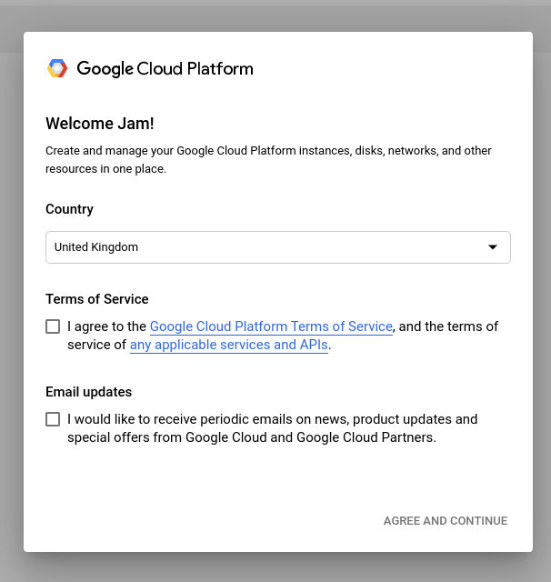

4. Press 'Create project'

   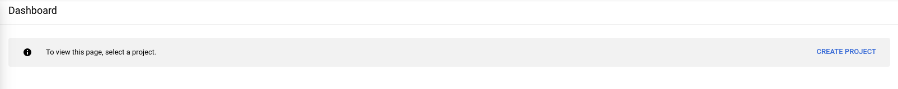

5. Give the project a name, e.g. 'NPC Feedback'

   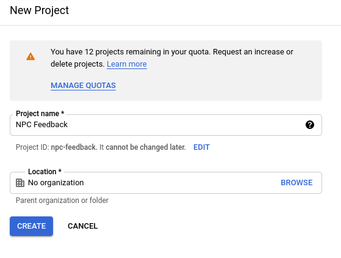

6. Click 'Create'
7. You will see a rather complicated dashboard. Open the navigation menu on the left and select 'APIs & Services' > 'Library'

   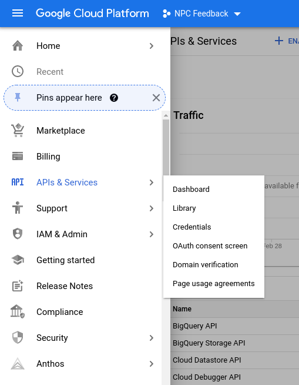

8. Search for 'google sheets'

   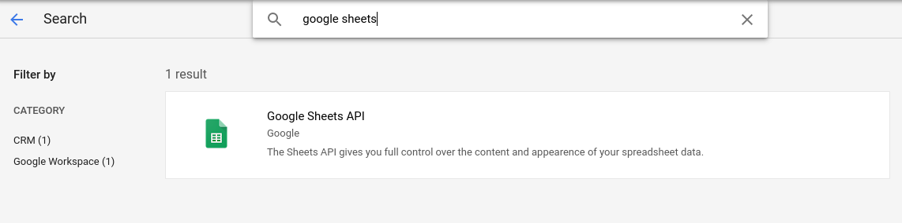

9. Click on the result 'Google Sheets' that appears
10. Click 'Enable'

   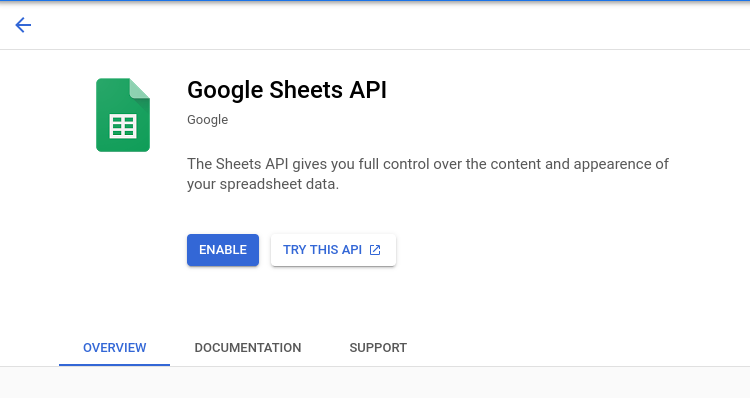

11. From the navigation menu on the left, select 'Credentials'

   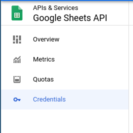

12. Click 'create credentials'

   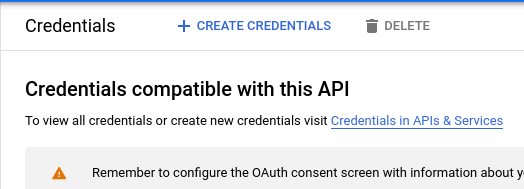

13. Select 'service account'

   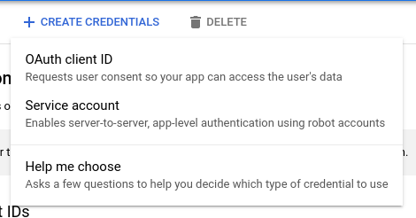

14. Give the account a name, e.g. 'NPC Feedback Bot' and click 'Create'

   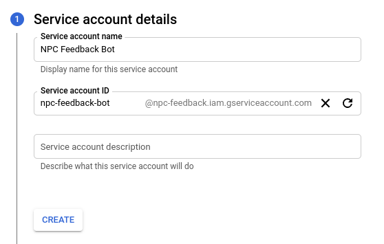

15. From the 'Select a role' dropdown, select 'Basic' > 'Editor'

   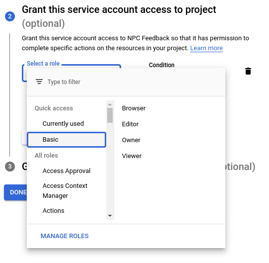

16. Press 'Continue'
17. Press 'Done' at the bottom
18. Copy the service account's email, and paste it somewhere safe - you will need it in section 2!
19. Click on the service account's email

   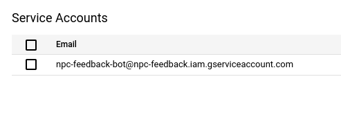

19. From the top navigation bar, select 'Keys'

   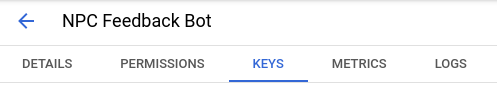

20. Select 'Add key' > 'Create new key'

   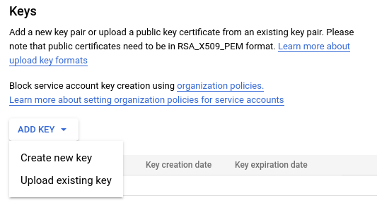

21. Select 'JSON' and click 'Create'

   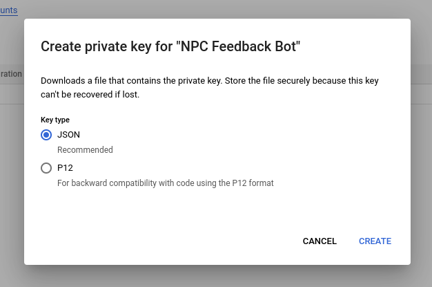

22. A `.json` file will be downloaded to your computer. This contains the private key, among other things. Securely send us this file, and then
    delete it from your computer (but only after making sure we have got it - it can't be regenerated!)

## Section 2: creating the Google Sheet

1. Make sure you are signed into a company Google account - not your personal one!
2. Go to: https://docs.google.com/spreadsheets/
3. Create a new blank spreadsheet
4. Fill in the top cells with the following text (case-sensitive):

   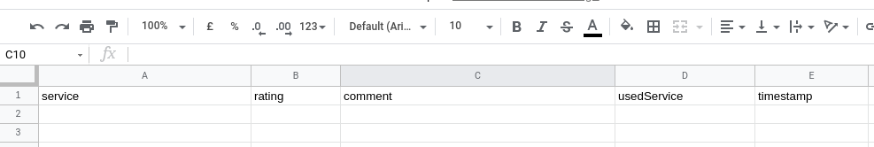

   That is: `service`, `rating`, `comment`, `usedService`, `timestamp`

5. In the top-right corner, click the 'Share' button
6. Name your spreadsheet if prompted
7. In the 'share' dialogue, paste the email of the service account that you copied in section 1
8. Make sure the permission is set to 'Editor'
9. Uncheck 'Notify people' and press 'Share'

**Congratulations!** You have successfully set everything up. Once we get things configured on our end, feedback for services will go to this spreadsheet.
